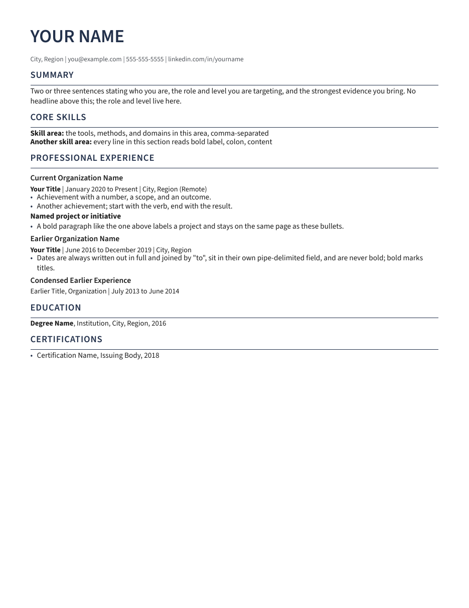

# pressume

Turn a Markdown resume or CV into a PDF, plain-text file, or Word document, then
check the files that were actually created.



## Why I made it

I keep my full career history in Markdown because it is portable, searchable,
and easy to review. I wanted the same source file to produce a clean resume, a
longer CV, and the plain text that hiring systems extract, without maintaining a
separate Word document by hand.

The conversion step was only half the problem. A PDF can look fine while its
text extracts in the wrong order, a link can stop working, a title can change,
or a page can overflow. pressume renders the document and then reopens the PDF,
TXT, or DOCX to check the things it knows how to test.

I built this for my own job search. My background is pharmacy, clinical
informatics, biomedical data, and knowledge systems, not professional software
engineering. Claude and ChatGPT were used extensively to help write and revise
the code, tests, and documentation. I set the requirements, reviewed the
behavior, and tested real outputs, but I do not claim that every line was
written by hand or that automated tests make the project infallible. That is
worth saying plainly in a public repository.

## Quick start

Install with [uv](https://docs.astral.sh/uv/):

```bash
uv tool install git+https://github.com/sethstraw/pressume.git
```

If the command is not on your `PATH`, run `uv tool update-shell` once. Then:

```bash
mkdir my-resume
cd my-resume
pressume new resume
pressume preview Resume.md --open
```

Edit `Resume.md` and create the final files:

```bash
pressume render
```

Without a configuration file, pressume reads Markdown files from the current
directory, writes to `./renders`, and creates PDF and TXT output.

## What it does

- Renders Markdown through Pandoc and Typst.
- Creates PDF and TXT by default, with DOCX available when requested.
- Provides three bundled themes and three spacing densities.
- Validates the Markdown before rendering.
- Checks page targets, extracted text, exact wording, links, metadata,
  accessibility structure, and important layout relationships in the PDF.
- Reopens TXT and DOCX output and checks their content and structure.
- Builds a group of documents in a temporary location before replacing existing
  output, so one failed document does not leave a partly updated set.
- Keeps a manifest of generated files so cleanup can distinguish its own output
  from files it did not create.

pressume does not score a resume, tailor its content, submit applications, or
claim compatibility with every applicant-tracking system. Its checks cover
specific, observable properties. You should still read the finished document
before sending it.

## Commands

| Command | Purpose |
| --- | --- |
| `pressume new resume` | Create a starter resume. |
| `pressume new cv` | Create a starter CV. |
| `pressume new letter` | Create a starter cover letter. |
| `pressume preview` | Render a local preview, optionally open it or watch for changes. |
| `pressume lint` | Validate Markdown without rendering. |
| `pressume render` | Validate, render, verify, and replace the requested output files. |
| `pressume check` | Verify existing output without rendering again. |
| `pressume inspect` | Report advisory readability and page-balance findings. |
| `pressume list` | Show which sources and output files are selected. |
| `pressume clean` | Preview stale generated files; add `--apply` to remove them. |
| `pressume init` | Create a documented `pressume.toml`. |
| `pressume refdoc` | Generate the DOCX style reference for the current theme. |
| `pressume doctor` | Report installation and project diagnostics. |

Run `pressume COMMAND --help` for the full options. Document commands support
`--json` for scripts.

```bash
pressume render Resume.md --formats pdf
pressume inspect Resume.md --json
pressume render --source ~/Documents/resumes --output ~/Desktop/applications
```

## Markdown format

The bundled templates are the easiest place to start. The standard resume
format expects:

- one H1 on the first line for the candidate's name;
- an optional contact line immediately after the name; email and phone are
  optional, so a public copy can leave them out;
- H2 section headings in a conventional order;
- H3 headings for roles inside experience sections;
- skills written as `**Label:** content`;
- dates written consistently, normally `January 2022 to March 2025`;
- no tables, HTML, images, code blocks, blockquotes, or footnotes under the
  standard policy.

`pressume lint` reports the rule and source line when the document does not
match the configured format. Academic, international, minimal, and letter
policies are available for documents that need a different contract.

## Letters

A cover letter is a document with its own policy. Give it a profile in
configuration:

```toml
[[documents]]
file = "Cover_Letter.md"
profile = "letter"
pages = 1

[profiles.letter]
policy = "letter"
```

The letter policy keeps the front of the resume contract: one H1 on the first
line for the name, and the contact paragraph directly after it. Everything
after that is prose. The policy empties the section
vocabulary, so any `##` heading fails as an unknown section, and no section is
required, labeled, or dated. The Markdown rules and the ban on tables, HTML,
images, code, blockquotes, footnotes, and numbered lists still apply, as do the
page target, text, link, metadata, and accessibility checks on the output. A
date-consistency warning is expected when the letter mentions no dates.

In the PDF, a letter's paragraphs are set apart by a visible gap in every theme
and density, and its metadata title reads `Name - Letter`. `pressume new
letter` writes a starter `Letter.md`.

## Themes and output

The bundled themes are:

- `modern`: Source Sans 3 with a restrained navy accent;
- `technical`: IBM Plex Sans with a slightly tighter layout;
- `traditional`: Source Serif 4 for a more conventional or academic document.

Preview a theme and spacing density without changing configuration:

```bash
pressume preview Resume.md --theme traditional --density spacious --open
```

The supported densities are `compact`, `balanced`, and `spacious`. Font, size,
margin, accent color, language, and region can also be set in configuration.

Paper is `us-letter` or `a4`. Both are set on the PDF and on the Word file, so
the two agree; a size the Word file cannot be given is rejected rather than
quietly downgraded. The PDF standard is `ua-1`, which tags the file for
accessible reading order, or `default` if a portal rejects a tagged PDF. PDF/A
is not offered: every PDF/A level requires a document date, and pressume writes
no date so the same source always produces the same file.

`[paths].fonts` adds font directories. They are searched before the fonts that
ship with pressume, so a font of your own with a bundled family's name is used
instead of the bundled one. Without that setting, rendering uses only the
bundled fonts and does not depend on what is installed on the machine.

## Configuration

Configuration is optional. Run `pressume init` to create a commented starter
file. Unknown settings and invalid values fail visibly rather than being
ignored.

```toml
[paths]
source_dir = "."
output_dir = "renders"

[output]
formats = ["pdf", "txt"]

[style]
theme = "modern"
density = "balanced"
paper = "us-letter"
language = "en"
region = "US"

[[documents]]
file = "Resume.md"
pages = 2
output_name = "Jane_Doe_Resume"

[checks]
required_strings = ["jane@example.com"]
protected_strings = ["Senior Clinical Data Architect"]
forbidden_strings = ["DRAFT"]
```

`required_strings` must appear. `forbidden_strings` must not appear. A
`protected_strings` value is conditional: if its first word appears, the full
configured phrase must appear. This is useful for official titles that must not
be shortened but do not belong in every version of a resume.

An exact `pages` target can be replaced with `min_pages` and `max_pages`.
Formats, metadata, and exact-string checks can be set for individual documents.
Named profiles can give a resume and a full CV different section rules while
keeping them in the same folder.

## What is checked

For PDF output, pressume checks the requested page count or range, compares text
from two independent extractors, and checks character policy, required and
protected wording, contact details, section order, dates, metadata, document
language, hyperlink annotations, tagged accessibility structure, and spacing
around important headings. The line above a section heading and its rule fails
under 2.0 pt of clearance and warns under 3.0 pt.

For TXT output, it checks the extracted text and exact-string rules. For DOCX,
it reopens the OOXML package and checks linear structure, text order, links, and
selected metadata. DOCX pagination is not certified because Word-compatible
applications do not all paginate identically.

`pressume inspect` is advisory. It points out things such as long bullets,
repeated openings, crowded pages, stranded headings, and sparse endings, but it
does not block an otherwise valid document. For a document with an exact `pages`
target, a final page whose text spans under 85% of the median height of the
pages before it also counts as a sparse ending.

## Privacy and safety

Rendering, checking, watching, and cleanup operate on local files and make no
network requests. A test enforces this: it blocks the socket calls this process
would have to make, then renders and verifies a document. Pandoc and Typst run
as separate processes, so that test cannot see inside them; what it proves is
that pressume's own code and every library it calls to render, reopen, and
check a file never open a connection. Opening a preview uses the system's local
viewer. Generated documents may contain author, title, description, keywords,
and language metadata, so review both content and metadata before sharing them.

`pressume clean` only removes files recorded in its output manifest, and only
when `--apply` is supplied. A file you put in the output folder yourself
survives it. A failed render leaves the existing files untouched, including
when the document renders successfully and then fails verification.

## Using it with tailorcv

tailorcv is a separate project that
uses language models to select and rewrite evidence from a master CV for a job
description. It produces Markdown; pressume can render that Markdown. Neither
application imports or requires the other.

## Development

```bash
git clone https://github.com/sethstraw/pressume.git
cd pressume
uv sync --locked --all-groups
bash scripts/gate.sh
```

`scripts/gate.sh` is the full verification gate, the same one CI runs.

Contributions, bug reports, and documentation corrections are welcome. See
[CONTRIBUTING.md](CONTRIBUTING.md), [SECURITY.md](SECURITY.md), and
[CODE_OF_CONDUCT.md](CODE_OF_CONDUCT.md).

## License

pressume is released under the [MIT License](LICENSE). Bundled fonts retain
their SIL Open Font Licenses in the package.
